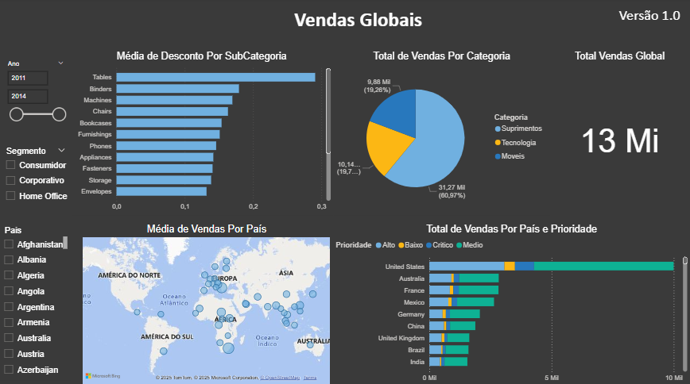

# 📊 Dashboard Power BI – Vendas Globais 🌍

Este projeto foi desenvolvido durante o curso da **Data Science Academy** e tem como objetivo analisar dados de **vendas globais** com foco em insights por categoria, país, desconto e prioridade.

---

## 🧠 Principais Insights

- **Móveis** lideram as vendas, representando mais de 60% do total.
- **Estados Unidos**, **Austrália** e **França** concentram o maior faturamento.
- **Prioridade crítica** tem maior volume nos EUA.
- **"Tables"** é a subcategoria com maior média de desconto.
- Filtros interativos por **ano, país e segmento** ajudam na exploração dos dados.

---

## 🛠️ Ferramentas Utilizadas

- Power BI Desktop
- Mapas e gráficos interativos
- Segmentações por:
  - Ano
  - Segmento
  - País

---

## 🖼️ Captura de Tela

---

## 📁 Acesse o Projeto

- [`Vendas_Globais.pbix`](./Vendas_Globais.pbix)

Abra com o Power BI Desktop para explorar os filtros e dados.

---

## 👩‍💻 Sobre

Projeto desenvolvido por Nathanny Soares durante o curso de Power BI para Data Science.

[🔗 LinkedIn](https://www.linkedin.com) • [💻 GitHub](https://github.com/nathannysoares)
